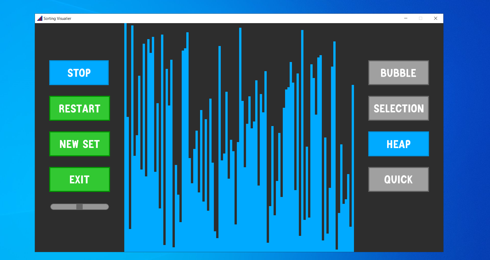
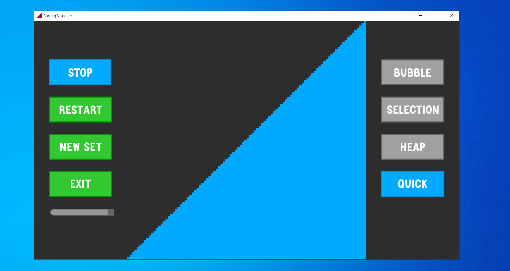

# Sorting-Visualizer

# Project Description:
The project visualizes 4 sorting algorithms:
* bubble sort (complexity: average O(n^2), worst-case O(n^2))
* selection sort (complexity: average O(n^2), worst-case O(n^2))
* heap sort (complexity: average O(n * log(n)), worst-case O(n * log(n)))
* quick sort (complexity: average O(n * log(n)), worst-case O(n^2))

# How to install:
If you're familiar with git you can clone the repo. Otherwise you can simply download whole project as a compressed folder.

